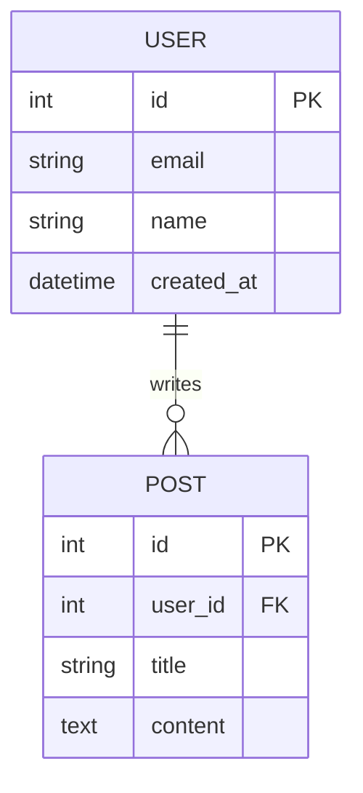

# Generate README Skill

This skill generates professional README documentation with three fidelity levels. All diagrams use Mermaid chart format.

---

## Workflow

### Step 1: Select Fidelity Level

Prompt the user to choose a fidelity level using the `question` tool:

```
Select README Fidelity Level:

[1] BASIC
    Project name, tech stack, quick start, installation, usage instructions

[2] STANDARD  
    Everything in BASIC + modules, contributing, license

[3] ADVANCE
    Everything in STANDARD + architecture diagrams, configuration, API reference, testing, deployment
```

Wait for user selection before proceeding.

---

### Step 2: Analyze Project

1. **Read project root** to identify:
   - Project name (from package.json, pom.xml, Cargo.toml, go.mod, pyproject.toml, or directory name)
   - Primary language and framework
   - Dependencies and dev dependencies
   - License file if present

2. **Read `.gitignore`** if it exists:
   - Parse all patterns (file extensions, directories, specific files)
   - Store exclusion list to filter out ignored items from documentation

3. **Scan directory structure**:
   - Identify source directories (src/, lib/, app/, etc.)
   - Identify test directories (test/, tests/, __tests__/, spec/, etc.)
   - Identify configuration files
   - Identify documentation files
   - Apply `.gitignore` exclusions to filtered results

---

### Step 3: Backup Existing README

If `README.md` exists in the project root:

1. Find the highest existing backup number:
   - Check for `README.1.md`, `README.2.md`, etc.
   - If none exist, start with `README.1.md`

2. Rename current `README.md` to `README.{n+1}.md`

3. Inform user of backup location

---

### Step 4: Generate README Based on Fidelity Level

**BASIC Level Template:**
See [basic-level-template.md](references/basic-level-template.md) for the complete template.


**STANDARD Level Template:**
See [standard-level-template.md](references/standard-level-template.md) for the complete template.

**ADVANCE Level Template:**
See [advance-level-template.md](references/advance-level-template.md) for the complete template.

## Mermaid Diagram Guidelines

### Architecture Diagrams

Use `graph TD` (top-down) or `graph LR` (left-right) for:

- System component relationships
- Service dependencies
- Data flow between components

**Best Practices:**
- Group related components in `subgraph` blocks
- Use descriptive node labels
- Keep diagrams focused on high-level relationships
- Limit to 15-20 nodes maximum

### Sequence Diagrams

Use `sequenceDiagram` for:

- API request/response flows
- Authentication sequences
- Multi-service interactions

**Best Practices:**
- Show only essential participants
- Include meaningful message labels
- Use activation boxes for important steps

### Flowcharts

Use `flowchart TD` or `flowchart LR` for:

- Decision processes
- Error handling flows
- Deployment pipelines

**Best Practices:**
- Use diamond shapes for decisions
- Keep paths clear and uncluttered
- Label all decision branches

### Entity Relationships

Use `erDiagram` for database schemas:



---

## .gitignore Handling

The skill reads `.gitignore` and excludes matching patterns from documentation:

### Supported Patterns

| Pattern | Example | Excludes |
|---------|---------|----------|
| Directory | `node_modules/` | Entire directory |
| File extension | `*.log` | All matching files |
| Specific file | `.env` | Exact file |
| Wildcard | `dist*` | Matches dist, dist-dev, etc. |
| Negation | `!important.log` | Un-excludes specific file |

### Implementation

When scanning the project:

1. Read `.gitignore` from project root
2. Parse each line into a glob pattern
3. Apply patterns to file/directory listing
4. Exclude all matching items from documentation generation
5. Note exclusions in README comments if relevant

---

## Agent Workflow

When instructed to generate a README:

1. **Prompt for fidelity level** using `question` tool
2. **Wait for user selection** (1, 2, or 3 / BASIC, STANDARD, ADVANCE)
3. **Analyze project** - scan root, read config files, detect tech stack
4. **Read `.gitignore`** - build exclusion list
5. **Check for existing README** - backup if exists
6. **Gather module information** (STANDARD+)
7. **Analyze architecture** and generate diagrams (ADVANCE)
8. **Generate README** with selected fidelity level sections
9. **Write to `README.md`** in project root
10. **Report success** and note backup location if applicable

---

## Constraints

- Never overwrite existing README without backing up first
- Always respect `.gitignore` patterns
- Use Mermaid format for all diagrams (no other diagram formats)
- Do not include sensitive information (API keys, passwords, tokens)
- Exclude node_modules, .git, dist, build directories from structure
- Generate factual content based on actual project analysis
