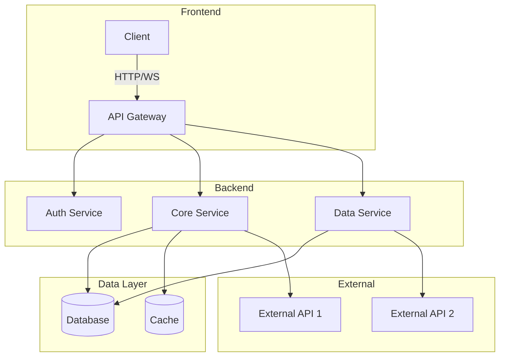
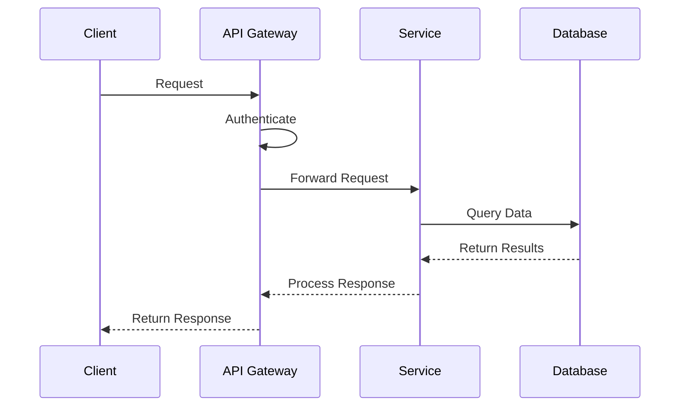
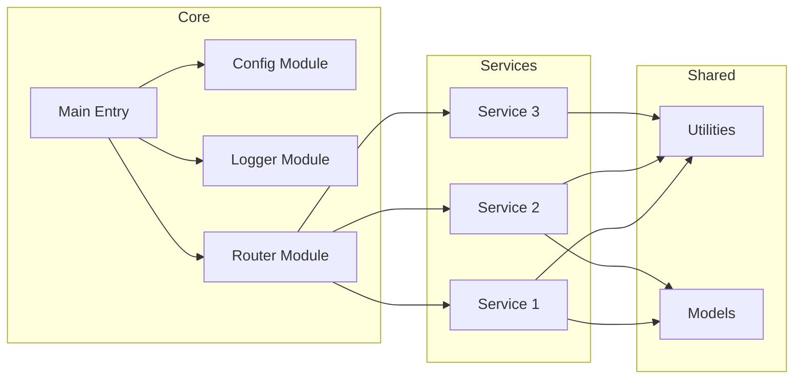
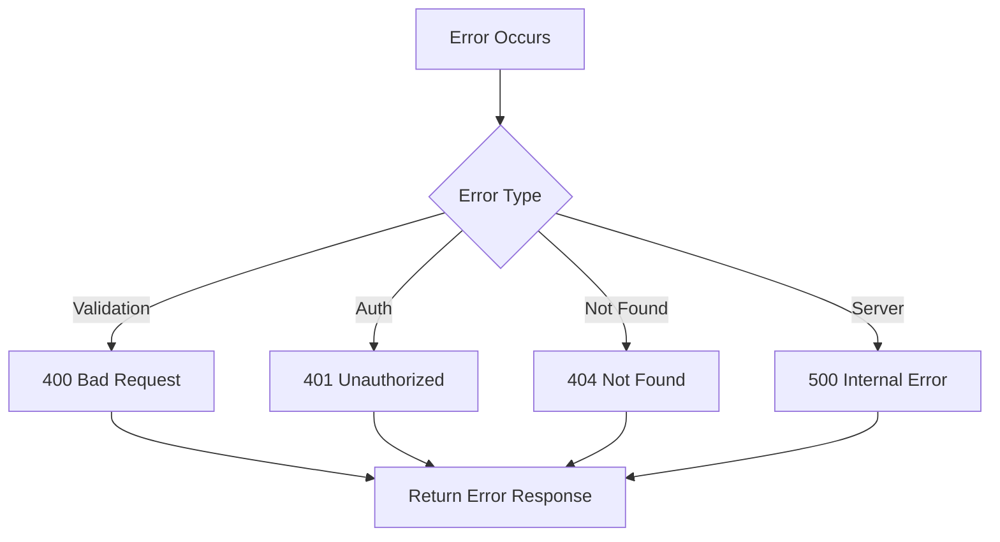
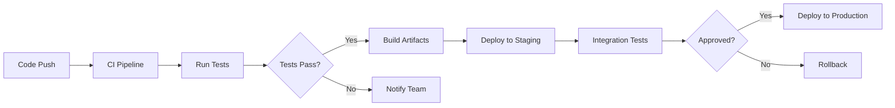
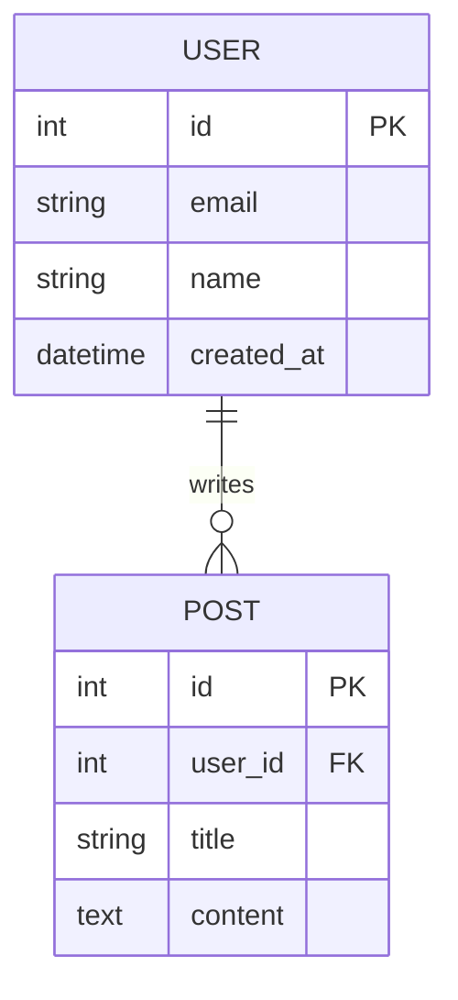

# Generate README Skill

This skill generates professional README documentation with three fidelity levels. All diagrams use Mermaid chart format.

---

## Workflow

### Step 1: Select Fidelity Level

Prompt the user to choose a fidelity level using the `question` tool:

```
Select README Fidelity Level:

[1] BASIC
    Project name, tech stack, quick start, installation, usage instructions

[2] STANDARD  
    Everything in BASIC + modules, contributing, license

[3] ADVANCE
    Everything in STANDARD + architecture diagrams, configuration, API reference, testing, deployment
```

Wait for user selection before proceeding.

---

### Step 2: Analyze Project

1. **Read project root** to identify:
   - Project name (from package.json, pom.xml, Cargo.toml, go.mod, pyproject.toml, or directory name)
   - Primary language and framework
   - Dependencies and dev dependencies
   - License file if present

2. **Read `.gitignore`** if it exists:
   - Parse all patterns (file extensions, directories, specific files)
   - Store exclusion list to filter out ignored items from documentation

3. **Scan directory structure**:
   - Identify source directories (src/, lib/, app/, etc.)
   - Identify test directories (test/, tests/, __tests__/, spec/, etc.)
   - Identify configuration files
   - Identify documentation files
   - Apply `.gitignore` exclusions to filtered results

---

### Step 3: Backup Existing README

If `README.md` exists in the project root:

1. Find the highest existing backup number:
   - Check for `README.1.md`, `README.2.md`, etc.
   - If none exist, start with `README.1.md`

2. Rename current `README.md` to `README.{n+1}.md`

3. Inform user of backup location

---

### Step 4: Generate README Based on Fidelity Level

**BASIC Level Template:**

See [basic-level-template.md](references/basic-level-template.md) for the complete template.

---

**STANDARD Level Template:**

---
Includes all BASIC sections plus:

## Project Structure

{project_root}/
├── {key_directory_1}/    # {purpose_1}
├── {key_directory_2}/    # {purpose_2}
├── {config_file}         # {purpose}
└── {other_notable_files}

*Note: Files and directories matching .gitignore patterns are excluded from this view.*

## Modules

| Module | Description | Key Files |
|-------|-------------|-----------|
| {module_1} | {description_1} | `{file_1}`, `{file_2}` |
| {module_2} | {description_2} | `{file_3}`, `{file_4}` |
| {module_3} | {description_3} | `{file_5}` |

### Module Details

#### {module_1_name}

{detailed_description}

**Key Components:**
- `{component_1}`: {purpose}
- `{component_2}`: {purpose}

#### {module_2_name}

{detailed_description}

**Key Components:**
- `{component_1}`: {purpose}
- `{component_2}`: {purpose}

## Contributing

### Development Setup

1. Fork the repository
2. Create a feature branch:
  ```bash
      git checkout -b feature/{branch_name}
  ```
3. Make your changes
4. Run tests:
   ```bash
   {test_command}
   ```
5. Submit a pull request

### Code Style

- Follow {coding_standard}
- Run linter before committing:
  ```bash
  {lint_command}
  ```

### Commit Convention

This project follows [Conventional Commits](https://www.conventionalcommits.org/):

```text
<type>(<scope>): <description>
```

Types: `feat`, `fix`, `docs`, `style`, `refactor`, `test`, `chore`


## License

This project is licensed under the {license_name} License - see the [LICENSE](LICENSE) file for details.

*Generated with STANDARD fidelity level*
---

**ADVANCE Level Template:**

---

Includes all STANDARD sections plus:

---
## Architecture

### System Overview



### Data Flow



### Module Relationships




## Configuration

### Environment Variables

| Variable | Description | Required | Default |
|----------|-------------|----------|---------|
| `{ENV_VAR_1}` | {description_1} | Yes | - |
| `{ENV_VAR_2}` | {description_2} | No | `{default_2}` |
| `{ENV_VAR_3}` | {description_3} | No | `{default_3}` |

### Configuration Files

| File | Purpose | Format |
|------|---------|--------|
| `{config_file_1}` | {purpose_1} | {format_1} |
| `{config_file_2}` | {purpose_2} | {format_2} |

### Example Configuration

```yaml
# {config_file_1}
{key_1}: {value_1}
{key_2}:
  {nested_key_1}: {nested_value_1}
  {nested_key_2}: {nested_value_2}
```

## API Reference

### Endpoints

#### {HTTP_METHOD} {endpoint_path}

{description}

**Parameters:**

| Name | Type | Location | Required | Description |
|------|------|----------|----------|-------------|
| `{param_1}` | {type} | {query|path|body} | {yes|no} | {description} |

**Request Body:**

```json
{
  "{field_1}": "{value_1}",
  "{field_2}": {value_2}
}
```

**Response:**

```json
{
  "status": "{status}",
  "data": {
    "{field_1}": "{value_1}",
    "{field_2}": {value_2}
  }
}
```

**Status Codes:**

| Code | Description |
|------|-------------|
| 200 | Success |
| 400 | Bad Request |
| 401 | Unauthorized |
| 500 | Internal Server Error | 

{Repeat for each endpoint}

### Error Handling



## Testing

### Test Structure

```
{test_directory}/
├── unit/           # Unit tests
├── integration/    # Integration tests
├── e2e/           # End-to-end tests
└── fixtures/      # Test data
```

### Running Tests

```bash
# Run all tests
{test_command}

# Run unit tests only
{test_unit_command}

# Run with coverage
{test_coverage_command}

# Run specific test file
{test_specific_command}
```

### Test Coverage

| Module | Coverage | Status |
|--------|----------|--------|
| {module_1} | {coverage_1}% | {status_1} |
| {module_2} | {coverage_2}% | {status_2} |
| {module_3} | {coverage_3}% | {status_3} |

### Writing Tests

```javascript
// Example unit test
describe('{ComponentName}', () => {
  it('should {test_description}', () => {
    // Arrange
    {setup_code}
    
    // Act
    {action_code}
    
    // Assert
    expect({result}).toEqual({expected});
  });
});
```

## Deployment

### Prerequisites

- {deployment_prerequisite_1}
- {deployment_prerequisite_2}

### Deployment Steps



### Manual Deployment

1. Build the application:
   ```bash
   {build_command}
   ```

2. Deploy to target environment:
   ```bash
   {deploy_command}
   ```

3. Verify deployment:
   ```bash
   {verify_command}
   ```

### Docker Deployment

```bash
# Build image
docker build -t {image_name}:{tag} .

# Run container
docker run -d \
  --name {container_name} \
  -p {host_port}:{container_port} \
  {image_name}:{tag}
```

### Environment-Specific Configuration

| Environment | URL | Database | Notes |
|-------------|-----|----------|-------|
| Development | {dev_url} | {dev_db} | Local setup |
| Staging | {staging_url} | {staging_db} | Pre-production |
| Production | {prod_url} | {prod_db} | Live environment |

## Troubleshooting

### Common Issues

| Issue | Cause | Solution |
|-------|-------|----------|
| {issue_1} | {cause_1} | {solution_1} |
| {issue_2} | {cause_2} | {solution_2} |
| {issue_3} | {cause_3} | {solution_3} |

### Debug Mode

Enable debug logging:
```bash
{debug_command}
```

### Logs Location

| Log Type | Location |
|----------|----------|
| Application | `{log_path}/app.log` |
| Error | `{log_path}/error.log` |
| Access | `{log_path}/access.log` |


## Performance

### Benchmarks

| Operation | Time | Notes |
|-----------|------|-------|
| {operation_1} | {time_1} | {notes_1} |
| {operation_2} | {time_2} | {notes_2} |

### Optimization Tips

- {tip_1}
- {tip_2}
- {tip_3}


*Generated with ADVANCE fidelity level*
---

## Mermaid Diagram Guidelines

### Architecture Diagrams

Use `graph TD` (top-down) or `graph LR` (left-right) for:

- System component relationships
- Service dependencies
- Data flow between components

**Best Practices:**
- Group related components in `subgraph` blocks
- Use descriptive node labels
- Keep diagrams focused on high-level relationships
- Limit to 15-20 nodes maximum

### Sequence Diagrams

Use `sequenceDiagram` for:

- API request/response flows
- Authentication sequences
- Multi-service interactions

**Best Practices:**
- Show only essential participants
- Include meaningful message labels
- Use activation boxes for important steps

### Flowcharts

Use `flowchart TD` or `flowchart LR` for:

- Decision processes
- Error handling flows
- Deployment pipelines

**Best Practices:**
- Use diamond shapes for decisions
- Keep paths clear and uncluttered
- Label all decision branches

### Entity Relationships

Use `erDiagram` for database schemas:



---

## .gitignore Handling

The skill reads `.gitignore` and excludes matching patterns from documentation:

### Supported Patterns

| Pattern | Example | Excludes |
|---------|---------|----------|
| Directory | `node_modules/` | Entire directory |
| File extension | `*.log` | All matching files |
| Specific file | `.env` | Exact file |
| Wildcard | `dist*` | Matches dist, dist-dev, etc. |
| Negation | `!important.log` | Un-excludes specific file |

### Implementation

When scanning the project:

1. Read `.gitignore` from project root
2. Parse each line into a glob pattern
3. Apply patterns to file/directory listing
4. Exclude all matching items from documentation generation
5. Note exclusions in README comments if relevant

---

## Agent Workflow

When instructed to generate a README:

1. **Prompt for fidelity level** using `question` tool
2. **Wait for user selection** (1, 2, or 3 / BASIC, STANDARD, ADVANCE)
3. **Analyze project** - scan root, read config files, detect tech stack
4. **Read `.gitignore`** - build exclusion list
5. **Check for existing README** - backup if exists
6. **Gather module information** (STANDARD+)
7. **Analyze architecture** and generate diagrams (ADVANCE)
8. **Generate README** with selected fidelity level sections
9. **Write to `README.md`** in project root
10. **Report success** and note backup location if applicable

---

## Constraints

- Never overwrite existing README without backing up first
- Always respect `.gitignore` patterns
- Use Mermaid format for all diagrams (no other diagram formats)
- Do not include sensitive information (API keys, passwords, tokens)
- Exclude node_modules, .git, dist, build directories from structure
- Generate factual content based on actual project analysis
