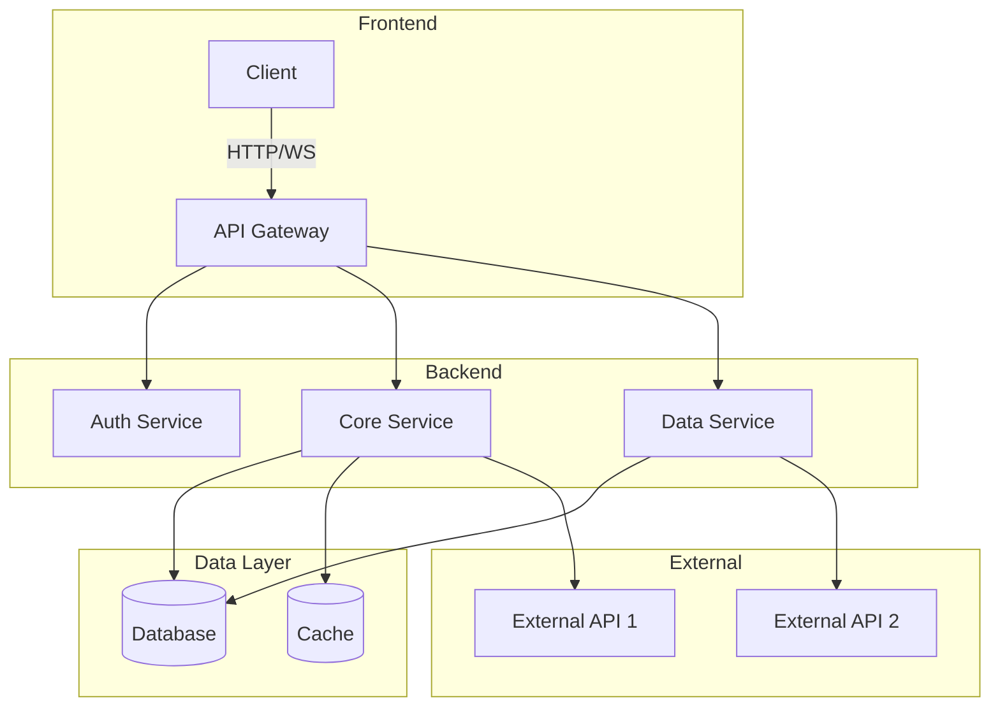
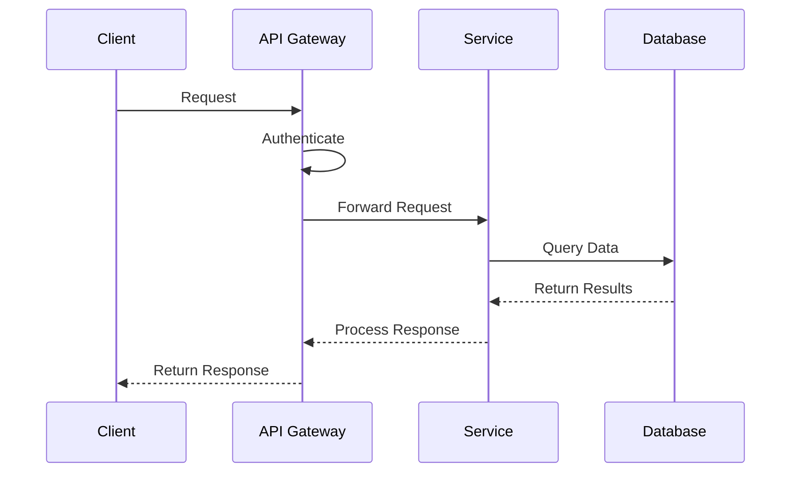
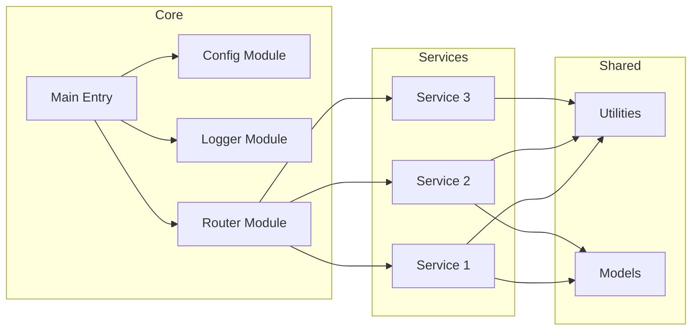
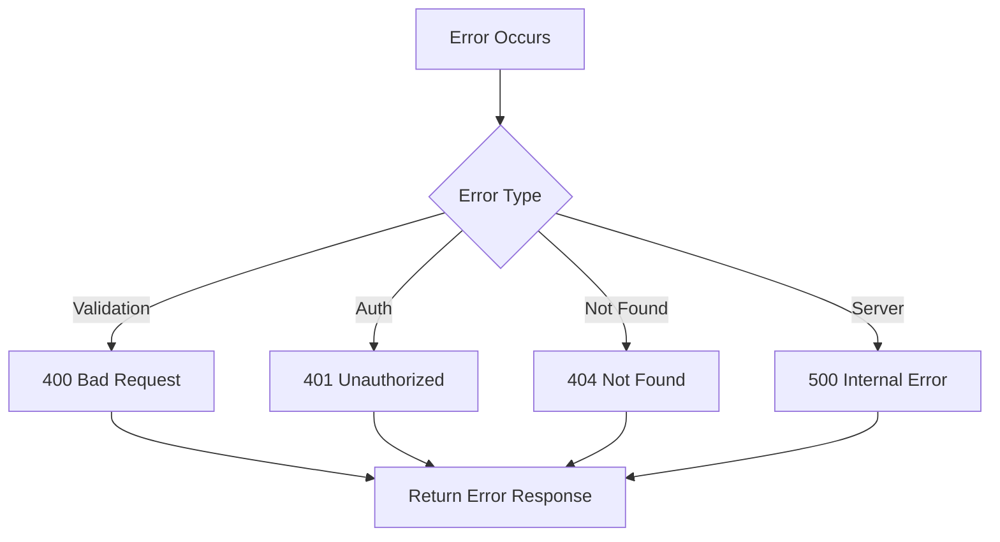
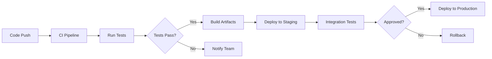

# ADVANCE Level Template
---

Includes all STANDARD sections plus:

---

## Architecture

### System Overview



### Data Flow



### Module Relationships




## Configuration

### Environment Variables

| Variable | Description | Required | Default |
|----------|-------------|----------|---------|
| `{ENV_VAR_1}` | {description_1} | Yes | - |
| `{ENV_VAR_2}` | {description_2} | No | `{default_2}` |
| `{ENV_VAR_3}` | {description_3} | No | `{default_3}` |

### Configuration Files

| File | Purpose | Format |
|------|---------|--------|
| `{config_file_1}` | {purpose_1} | {format_1} |
| `{config_file_2}` | {purpose_2} | {format_2} |

### Example Configuration

```yaml
# {config_file_1}
{key_1}: {value_1}
{key_2}:
  {nested_key_1}: {nested_value_1}
  {nested_key_2}: {nested_value_2}
```

## API Reference

### Endpoints

#### {HTTP_METHOD} {endpoint_path}

{description}

**Parameters:**

| Name | Type | Location | Required | Description |
|------|------|----------|----------|-------------|
| `{param_1}` | {type} | {query|path|body} | {yes|no} | {description} |

**Request Body:**

```json
{
  "{field_1}": "{value_1}",
  "{field_2}": {value_2}
}
```

**Response:**

```json
{
  "status": "{status}",
  "data": {
    "{field_1}": "{value_1}",
    "{field_2}": {value_2}
  }
}
```

**Status Codes:**

| Code | Description |
|------|-------------|
| 200 | Success |
| 400 | Bad Request |
| 401 | Unauthorized |
| 500 | Internal Server Error | 

{Repeat for each endpoint}

### Error Handling



## Testing

### Test Structure

```
{test_directory}/
├── unit/           # Unit tests
├── integration/    # Integration tests
├── e2e/           # End-to-end tests
└── fixtures/      # Test data
```

### Running Tests

```bash
# Run all tests
{test_command}

# Run unit tests only
{test_unit_command}

# Run with coverage
{test_coverage_command}

# Run specific test file
{test_specific_command}
```

### Test Coverage

| Module | Coverage | Status |
|--------|----------|--------|
| {module_1} | {coverage_1}% | {status_1} |
| {module_2} | {coverage_2}% | {status_2} |
| {module_3} | {coverage_3}% | {status_3} |

### Writing Tests

```javascript
// Example unit test
describe('{ComponentName}', () => {
  it('should {test_description}', () => {
    // Arrange
    {setup_code}
    
    // Act
    {action_code}
    
    // Assert
    expect({result}).toEqual({expected});
  });
});
```

## Deployment

### Prerequisites

- {deployment_prerequisite_1}
- {deployment_prerequisite_2}

### Deployment Steps



### Manual Deployment

1. Build the application:
   ```bash
   {build_command}
   ```

2. Deploy to target environment:
   ```bash
   {deploy_command}
   ```

3. Verify deployment:
   ```bash
   {verify_command}
   ```

### Docker Deployment

```bash
# Build image
docker build -t {image_name}:{tag} .

# Run container
docker run -d \
  --name {container_name} \
  -p {host_port}:{container_port} \
  {image_name}:{tag}
```

### Environment-Specific Configuration

| Environment | URL | Database | Notes |
|-------------|-----|----------|-------|
| Development | {dev_url} | {dev_db} | Local setup |
| Staging | {staging_url} | {staging_db} | Pre-production |
| Production | {prod_url} | {prod_db} | Live environment |

## Troubleshooting

### Common Issues

| Issue | Cause | Solution |
|-------|-------|----------|
| {issue_1} | {cause_1} | {solution_1} |
| {issue_2} | {cause_2} | {solution_2} |
| {issue_3} | {cause_3} | {solution_3} |

### Debug Mode

Enable debug logging:
```bash
{debug_command}
```

### Logs Location

| Log Type | Location |
|----------|----------|
| Application | `{log_path}/app.log` |
| Error | `{log_path}/error.log` |
| Access | `{log_path}/access.log` |


## Performance

### Benchmarks

| Operation | Time | Notes |
|-----------|------|-------|
| {operation_1} | {time_1} | {notes_1} |
| {operation_2} | {time_2} | {notes_2} |

### Optimization Tips

- {tip_1}
- {tip_2}
- {tip_3}


*Generated with ADVANCE fidelity level*
